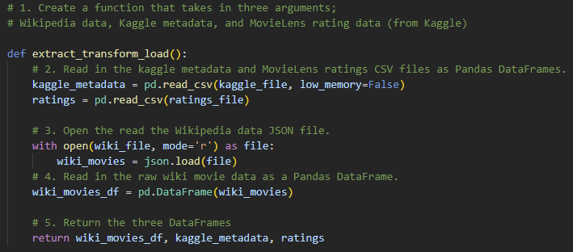
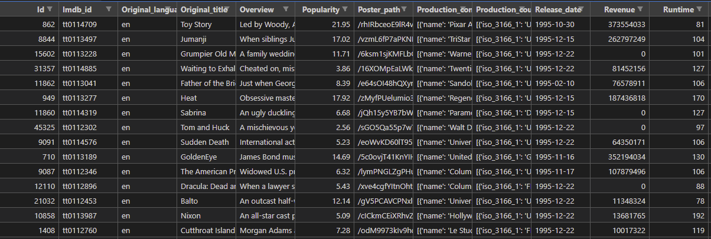

# Movies-ETL
<<<<<<< HEAD
Deliverable 1: Write an ETL Function to Read Three Data Files

Deliverable 2: Extract and Transform the Wikipedia Data

```Python
# 2 Add the function that takes in three arguments;
# Wikipedia data, Kaggle metadata, and MovieLens rating data (from Kaggle)
def extract_transform_load():
    # Read in the kaggle metadata and MovieLens ratings CSV files as Pandas DataFrames.
    kaggle_metadata = pd.read_csv(kaggle_file, low_memory=False)
    ratings = pd.read_csv(ratings_file)

    # Open and read the Wikipedia data JSON file.
    with open(wiki_file, mode='r') as file:
        wiki_movies_raw = json.load(file)

    # 3. Write a list comprehension to filter out TV shows.
    wiki_movies = [movie for movie in wiki_movies_raw
                   if ('Director' in movie or 'Directed by' in movie)
                   and 'imdb_link' in movie
                   and 'No. of episodes' not in movie]

    # 4. Write a list comprehension to iterate through the cleaned wiki movies list
    # and call the clean_movie function on each movie.
    clean_movies = [clean_movie(movie) for movie in wiki_movies]

    # 5. Read in the cleaned movies list from Step 4 as a DataFrame.
    wiki_movies_df = pd.DataFrame(clean_movies)

    # 6. Write a try-except block to catch errors while extracting the IMDb ID using a regular expression string and
    try:
        # code taken from module
        wiki_movies_df['imdb_id'] = wiki_movies_df['imdb_link'].str.extract(
            r'(tt\d{7})')
        wiki_movies_df.drop_duplicates(subset='imdb_id', inplace=True)
    except Exception as i:
        print(i)

    #  7. Write a list comprehension to keep the columns that don't have null values from the wiki_movies_df DataFrame.
    wiki_columns_to_keep = [column for column in wiki_movies_df.columns if wiki_movies_df[column].isnull().sum() < len(wiki_movies_df) * 0.9]
    wiki_movies_df = wiki_movies_df[wiki_columns_to_keep]

    # 8. Create a variable that will hold the non-null values from the “Box office” column.
    box_office = wiki_movies_df['Box office'].dropna()

    # 9. Convert the box office data created in Step 8 to string values using the lambda and join functions.
    box_office = box_office.apply(
        lambda x: ' '.join(x) if type(x) == list else x)

    # 10. Write a regular expression to match the six elements of "form_one" of the box office data.
    form_one = r'\$\s*\d+\.?\d*\s*[mb]illi?on'

    # 11. Write a regular expression to match the three elements of "form_two" of the box office data.
    form_two = r'\$\s*\d{1,3}(?:[,\.]\d{3})+(?!\s[mb]illion)'

    # 12. Add the parse_dollars function.
    def parse_dollars(s):
        # if s is not a string, return NaN
        if type(s) != str:
            return np.nan
        # if input is of the form $###.# million
        if re.match(r'\$\s*\d+\.?\d*\s*milli?on', s, flags=re.IGNORECASE):
            # remove dollar sign and " million"
            s = re.sub('\$|\s|[a-zA-Z]', '', s)
            # convert to float and multiply by a million
            value = float(s) * 10**6
            # return value
            return value
        # if input is of the form $###.# billion
        elif re.match(r'\$\s*\d+\.?\d*\s*billi?on', s, flags=re.IGNORECASE):
            # remove dollar sign and " billion"
            s = re.sub('\$|\s|[a-zA-Z]', '', s)
            # convert to float and multiply by a billion
            value = float(s) * 10**9
            # return value
            return value
        # if input is of the form $###,###,###
        elif re.match(r'\$\s*\d{1,3}(?:[,\.]\d{3})+(?!\s[mb]illion)', s, flags=re.IGNORECASE):
            # remove dollar sign and commas
            s = re.sub('\$|,', '', s)
            # convert to float
            value = float(s)
            # return value
            return value
        # otherwise, return NaN
        else:
            return np.nan

    # 13. Clean the box office column in the wiki_movies_df DataFrame.
    wiki_movies_df['box_office'] = box_office.str.extract(
        f'({form_one}|{form_two})', flags=re.IGNORECASE)[0].apply(parse_dollars)
    wiki_movies_df.drop('Box office', axis=1, inplace=True)

    # 14. Clean the budget column in the wiki_movies_df DataFrame.
    budget = wiki_movies_df['Budget'].dropna()
    budget = budget.map(lambda x: ' '.join(x) if type(x) == list else x)
    budget = budget.str.replace(r'\$.*[-—–](?![a-z])', '$', regex=True)
    wiki_movies_df['budget'] = budget.str.extract(
        f'({form_one}|{form_two})', flags=re.IGNORECASE)[0].apply(parse_dollars)

    # 15. Clean the release date column in the wiki_movies_df DataFrame.
    release_date = wiki_movies_df['Release date'].dropna().apply(
        lambda x: ' '.join(x) if type(x) == list else x)
    date_form_one = r'(?:January|February|March|April|May|June|July|August|September|October|November|December)\s[123]?\d,\s\d{4}'
    date_form_two = r'\d{4}.[01]\d.[0123]\d'
    date_form_three = r'(?:January|February|March|April|May|June|July|August|September|October|November|December)\s\d{4}'
    date_form_four = r'\d{4}'
    wiki_movies_df['release_date'] = pd.to_datetime(release_date.str.extract(
        f'({date_form_one}|{date_form_two}|{date_form_three}|{date_form_four})')[0], infer_datetime_format=True)

    # 16. Clean the running time column in the wiki_movies_df DataFrame.
    running_time = wiki_movies_df['Running time'].dropna().apply(
        lambda x: ' '.join(x) if type(x) == list else x)
    running_time_extract = running_time.str.extract(
        r'(\d+)\s*ho?u?r?s?\s*(\d*)|(\d+)\s*m')
    running_time_extract = running_time_extract.apply(
        lambda col: pd.to_numeric(col, errors='coerce')).fillna(0)
    wiki_movies_df['running_time'] = running_time_extract.apply(
        lambda row: row[0]*60 + row[1] if row[2] == 0 else row[2], axis=1)
    wiki_movies_df.drop('Running time', axis=1, inplace=True)

    # Return three variables. The first is the wiki_movies_df DataFrame
    return wiki_movies_df, kaggle_metadata, ratings
```
Deliverable 3: Extract and Transform the Kaggle data
```Python
    # 2. Clean the Kaggle metadata.
    kaggle_metadata = kaggle_metadata[kaggle_metadata['adult'] == 'False'].drop('adult',axis='columns')
    kaggle_metadata['video'] = kaggle_metadata['video'] == 'True'
    kaggle_metadata['budget'] = kaggle_metadata['budget'].astype(int)
    kaggle_metadata['id'] = pd.to_numeric(kaggle_metadata['id'], errors='raise')
    kaggle_metadata['popularity'] = pd.to_numeric(kaggle_metadata['popularity'], errors='raise')
    kaggle_metadata['release_date'] = pd.to_datetime(kaggle_metadata['release_date'])

    # 3. Merged the two DataFrames into the movies DataFrame.
    movies_df = pd.merge(wiki_movies_df, kaggle_metadata, on='imdb_id', suffixes=['_wiki','_kaggle'])

    # 4. Drop unnecessary columns from the merged DataFrame.
    movies_df.drop(columns=['title_wiki','release_date_wiki','Language','Production company(s)'], inplace=True)

    # 5. Add in the function to fill in the missing Kaggle data.
    def fill_missing_kaggle_data(df, kaggle_column, wiki_column):
        df[kaggle_column] = df.apply(
            lambda row: row[wiki_column] if row[kaggle_column] == 0 else row[kaggle_column]
            , axis=1)
        df.drop(columns=wiki_column, inplace=True)

    # 6. Call the function in Step 5 with the DataFrame and columns as the arguments.
    fill_missing_kaggle_data(movies_df, 'runtime', 'running_time')
    fill_missing_kaggle_data(movies_df, 'budget_kaggle', 'budget_wiki')
    fill_missing_kaggle_data(movies_df, 'revenue', 'box_office')

    # 7. Filter the movies DataFrame for specific columns.
    movies_df = movies_df.loc[:, ['imdb_id','id','title_kaggle','original_title','tagline','belongs_to_collection','url','imdb_link',
                       'runtime','budget_kaggle','revenue','release_date_kaggle','popularity','vote_average','vote_count',
                       'genres','original_language','overview','spoken_languages','Country',
                       'production_companies','production_countries','Distributor',
                       'Producer(s)','Director','Starring','Cinematography','Editor(s)','Writer(s)','Composer(s)','Based on'
                      ]]

    # 8. Rename the columns in the movies DataFrame.
    movies_df.rename({'id':'kaggle_id',
                  'title_kaggle':'title',
                  'url':'wikipedia_url',
                  'budget_kaggle':'budget',
                  'release_date_kaggle':'release_date',
                  'Country':'country',
                  'Distributor':'distributor',
                  'Producer(s)':'producers',
                  'Director':'director',
                  'Starring':'starring',
                  'Cinematography':'cinematography',
                  'Editor(s)':'editors',
                  'Writer(s)':'writers',
                  'Composer(s)':'composers',
                  'Based on':'based_on'
                 }, axis='columns', inplace=True)

    # 9. Transform and merge the ratings DataFrame.
    rating_counts = ratings.groupby(['movieId','rating'], as_index=False).count().rename({'userId':'count'}, axis=1).pivot(index='movieId',columns='rating', values='count')
    rating_counts.columns = ['rating_' + str(col) for col in rating_counts.columns]
    movies_with_ratings_df = pd.merge(movies_df, rating_counts, left_on='kaggle_id', right_index=True, how='left')
    movies_with_ratings_df[rating_counts.columns] = movies_with_ratings_df[rating_counts.columns].fillna(0)
    
    return wiki_movies_df, movies_with_ratings_df, movies_df
```

Deliverable 4: Create the Movie Database


=======

Deliverable 1: Write an ETL Function to Read Three Data Files

Deliverable 2: Extract and Transform the Wikipedia Data

Deliverable 3: Extract and Transform the Kaggle data

Deliverable 4: Create the Movie Database

>>>>>>> 0ae1af3a78e1ac6e00c86ea422a96faafb701588
